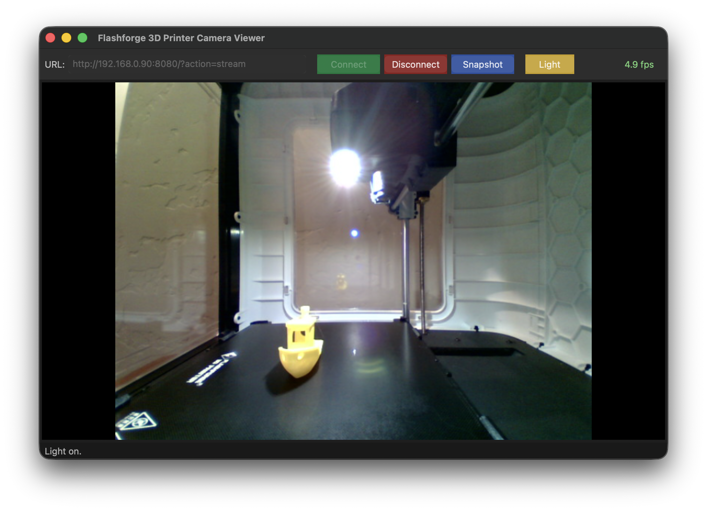

# Flashforge Adventurer 3/4/5 3D Printer Camera Viewer

A lightweight, cross-platform desktop application to view the MJPEG camera stream on a **Flashforge Adventurer 3/4/5** (and other compatible 3D printers) using **wxWidgets** and **FFmpeg**.

---

## Features

- Live MJPEG video display with aspect-ratio-preserving scaling
- Configurable IP address and path
- Real-time FPS counter
- One-click PNG snapshot (saved to user data directory)
- Light toggle button
- TCP transport mode for reliable stream over Wi-Fi
- Clean dark UI

---

## Screenshots



---

## Project Structure

```text
FlashView/
├── ChangeLog               # Version history
├── CMakeLists.txt          # Top-level build script
├── include/
│   ├── App.h               # App header file
│   └── MainFrame.h         # MainFrame header file
├── LICENSE                 # Software license description
├── README.md               # This file
├── References/
│   └── FlashView_on_macOS.png  # Screenshot of this app on macOS
├── resources/
│   ├── FlashView.icns      # Application icons
│   └── FlashView.png       # Application icon
└── src/
    ├── App.cpp             # wxApp entry point
    └── MainFrame.cpp       # Main application window
```

---

## Dependencies

| Library       | Version | Purpose                        |
|---------------|---------|--------------------------------|
| wxWidgets     | 3.2+    | Cross-platform GUI             |
| libavformat   | 5.x/6.x | RTSP container / demuxer       |
| libavcodec    | 5.x/6.x | H.264 / MJPEG decoder          |
| libavutil     | 5.x/6.x | FFmpeg utilities               |
| libswscale    | 5.x/6.x | Pixel format conversion → RGB  |

---

## Building

### Prerequisites: CMake 3.16+, a C++17 compiler

---

### Linux (Ubuntu / Debian)

```bash
# Install dependencies
sudo apt update
sudo apt install -y \
    build-essential cmake \
    libwxgtk3.2-dev \
    libavformat-dev libavcodec-dev libavutil-dev libswscale-dev

# Clone / enter source
cd FlashView

# Configure & build
cmake -B build -DCMAKE_BUILD_TYPE=Release
cmake --build build -j$(nproc)

# Run
./build/FlashView
```

---

### macOS (Homebrew)

```bash
# Install dependencies
brew install cmake wxwidgets ffmpeg

# Configure & build
cmake -B build -DCMAKE_BUILD_TYPE=Release
cmake --build build -j$(sysctl -n hw.logicalcpu)

# Run
open build/FlashView.app
# or
./build/FlashView
```

---

### Windows (vcpkg + Visual Studio 2022)

1. **Install vcpkg** (if not already):

   ```powershell
   git clone https://github.com/microsoft/vcpkg C:\vcpkg
   C:\vcpkg\bootstrap-vcpkg.bat
   ```

2. **Install dependencies**:

   ```powershell
   C:\vcpkg\vcpkg install wxwidgets:x64-windows ffmpeg:x64-windows
   ```

3. **Configure & build**:

   ```powershell
   cmake -B build `
     -DCMAKE_TOOLCHAIN_FILE=C:\vcpkg\scripts\buildsystems\vcpkg.cmake `
     -DVCPKG_TARGET_TRIPLET=x64-windows `
     -DCMAKE_BUILD_TYPE=Release
   cmake --build build --config Release
   ```

4. **Run**:

   ```powershell
   .\build\Release\FlashView.exe
   ```

---

## Usage

1. Find your Adventurer 3D Printer's IP address in its **touchscreen Settings → Network** menu.
2. Launch **FlashView**.
3. Enter the printer IP (default port `8080`, path `/?action=stream`).
4. Click **Connect**.
5. Click **Snapshot** at any time to save a PNG frame.
6. Click **Disconnect** to stop streaming.

### Default Adventurer 3D Printer Camera URL

```text
http://<printer-ip>:8080/?action=stream
```

---

## Snapshot location

Snapshots are saved to:

| Platform | Path                               |
|----------|------------------------------------|
| Linux    | `~/Documents/FlashPrint/`          |
| macOS    | `~/Documents/FlashPrint/`          |
| Windows  | `%HOMEPATH%\Documents\FlashPrint\` |

Filename format: `snapshot_YYYYMMDD_HHMMSS.png`

---

## Troubleshooting

| Symptom                  | Fix                                                          |
|--------------------------|--------------------------------------------------------------|
| "Failed to open stream"  | Check IP address and that printer is on the same network     |
| Black screen / no frames | Ensure the print job is active (camera may be off when idle) |
| Choppy video             | The app uses TCP transport; ensure Wi-Fi signal is strong    |
| Port already in use      | Maybe only one client can connect to the camera at a time    |

---

## License

Released under the MIT License. See LICENSE file for details.
